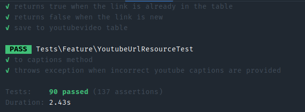
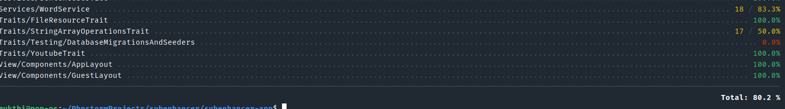

## How to set up the application

```bash
cp .env.example .env
```

```bash
docker run --rm \
    -u "$(id -u):$(id -g)" \
    -v "$(pwd):/var/www/html" \
    -w /var/www/html \
    laravelsail/php83-composer:latest \
    composer install --ignore-platform-reqs
```

```bash
./vendor/bin/sail up
```

```bash
./vendor/bin/sail artisan key:generate
```

```bash
./vendor/bin/sail artisan migrate
```
```bash
./vendor/bin/sail artisan db:seed
```

## Running Tests 
```bash
./vendor/bin/sail  artisan test
```


```bash
./vendor/bin/sail  artisan test --coverage
```


