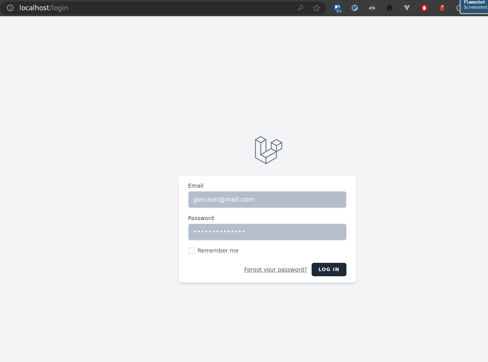
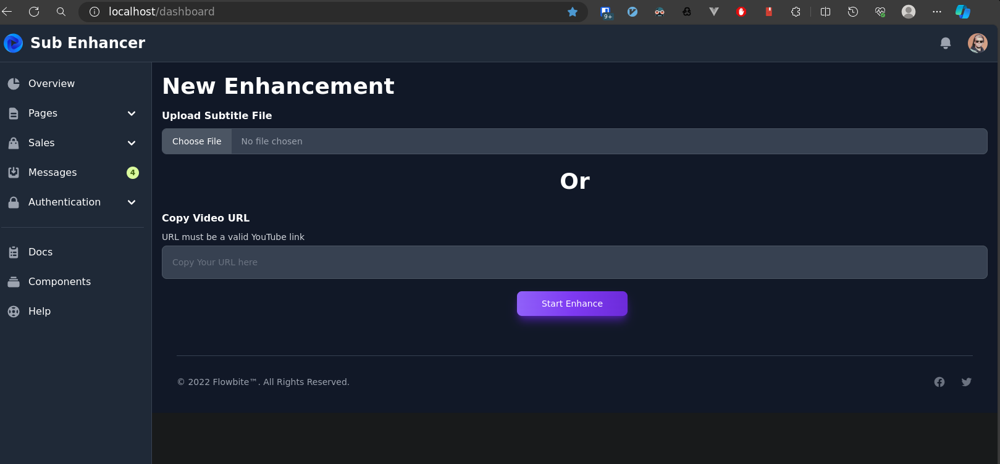
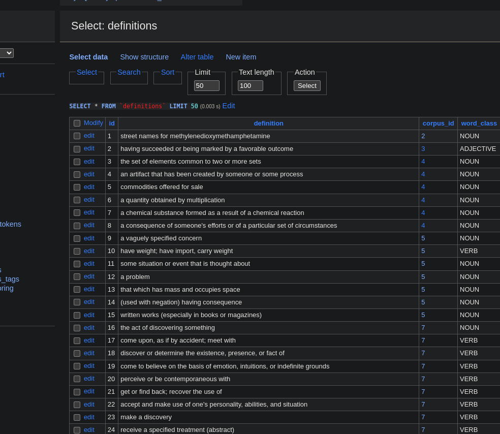

## Introduction

In this branch, for the demonstration purposes following End points/Services
are mocked.

[YouTube captions](https://github.com/9vimu9/subenhancer-app/blob/demo/app/Apis/YoutubeCaptionsGrabberApi/MockYoutubeCaptionsGrabberApi.php)
-This endpoint is used to retreive the transcript/closed caption of a YouTube video.

[Definitions Selector](https://github.com/9vimu9/subenhancer-app/blob/demo/app/Apis/DefinitionSelectorApi/MockDefinitionSelectorApi.php)
-Word can have multiple definitions. Then based on the context, correct definition must be selected. Look at the below example

**He always wanted to be a Hollywood star**.
The word ‘star’ can be described as “A famous and good singer, performer, sports player, actor, personality, etc.”

**The Milky Way galaxy contains between 200 and 400 billion stars**
In this, the word star means “a big ball of burning gas in space that we view as a point of light in the night sky.”

So the context is crucial to pick the correct definition. Definitions Selector is being developed. Therefore it is mocked in this branch.

[dictionaries API](https://github.com/9vimu9/subenhancer-app/blob/demo/app/Apis/DefinitionsAPI/DpVenturesWordsApi.php)
-This is a Paid API. API-Token is needed.

## Steps

1. Set up the application
2. Go to http://localhost/dashboard.
3. Enter the credentials in .env (GENERIC_USER_EMAIL,GENERIC_USER_PASSWORD)

4. Insert a valid YouTube link. it has to be one of the following. Becasue YouTube captions
grabber API is hard coded.

   1. https://www.youtube.com/watch?v=25N0R1KnXVs
   2. https://www.youtube.com/watch?v=Zce-V0YVzeI
   3. https://www.youtube.com/watch?v=S718YtbwrzY
   4. https://www.youtube.com/watch?v=Nb1PrONDHhk
   

5. Press Start Enhance.
   
6. Once the process is completed, You can see tables are filled with the records. Please note that I'm still improving it. Therefore unexpected errors, timeouts can be occured.
