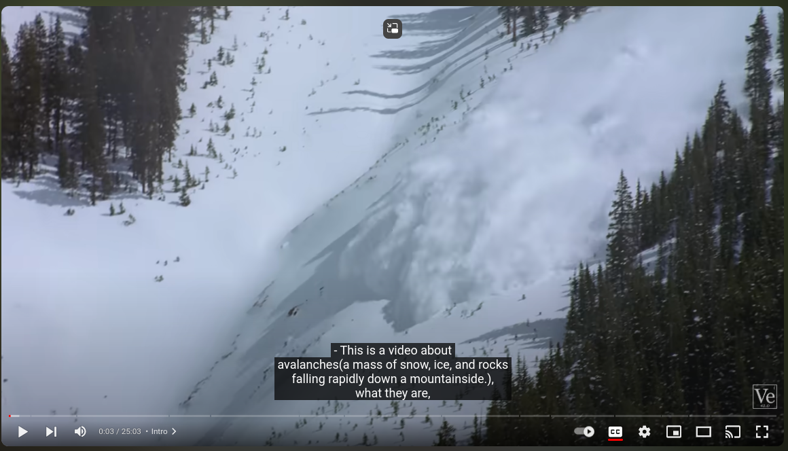

## Purpose

I Watch(lots of) YouTube Videos

That is my main source of entertainment and knowledge.

Because of the larger screen, better controls, and third-party extensions, the YouTube web app is my main way to watch videos. Extensions like AdBlock for YouTube, Looper for YouTube, SponsorBlock, and Dearrow can improve your YouTube experience in many ways.

I watch videos with closed captions. It helps me understand the content better, and it improves my English vocabulary. But when I see a word that I don't know, I have two options, and I hate both options equally.

1. Pause the video and look up the word. This will break the continuity of the video.
2. Ignore it. If I do this multiple times, I might not fully understand the content.

However, if there were a way to see the meaning of the word while watching the video, there would be no more pauses.


So, I decided to create an extension to come up with a solution. I call it SubEnhancer.

#### How Does It Work?
<u>completed tasks within this repository indicated in bold letters</u>
1. Install the extension and sign in to the service.
2. Open a YouTube tab.
3. <b>The extension detects it and sends the video ID and user ID to the backend service (this repository holds the code for the backend service).
4. The backend service (BS) looks for the transcript of the video by sending the video ID to a transcript service (TS) written in Python.
5. If there is a transcript, TS returns it in JSON format. It looks like this:</b>
```javascript
[
    {
        "text":"Welcome back",
        "start":300,
        "end":2400
    },
    {
        "text":"thank you very much very kind you lovely",
        "start":800,
        "end":3900
    }
]
```
6. <b>It is a JSON array. Each JSON object contains a text (closed caption), start time (when the text starts to show), and end time (when the text stops showing). 
7. The backend service (BS) transforms the JSON into a collection of Caption objects, which we call `CaptionCollection.`
This `CaptionCollection` is very useful. It is used to save the duration, caption, and other vital data to the tables. 
8. Then, BS converts the JSON to a string and sends it to the word filtering service (WFS). 
9. WFS will return a list of words with no duplicates and no stop words. 
10. This list is called the `Filtered Words Collection` (FWC).
11. BS has a table of thousands of words (`corpus` table) and another table with definitions for each word (`definitions` table). 
12. BS searches the FWC words to find definitions. 
13. For words that have no definition in the definitions table, BS sends them to a third-party dictionary service to find definitions. 
14. If definitions are found, the words and their new definitions will be saved.</b>
15. Then, BS sends an email notification to the user. 
16. By clicking the link in the email, the user can see the FWC with the definitions for the particular video. 
17. When a word has multiple meanings, word sense disambiguation is utilized to identify the most suitable definition based on its context. 
18. The user selects which words are not known and saves their selections.
19. Then user will have to reload the YouTube Tab. 
20. User reloads the YouTube tab. The extension grabs the updated transcription with definitions and shows its transcription by updating the DOM. See the example below.

    https://youtu.be/Zce-V0YVzeI?si=k9k3fSub9KkQxYak&t=3
## How to set up the application

```bash
cp .env.example .env
```

```bash
docker run --rm \
    -u "$(id -u):$(id -g)" \
    -v "$(pwd):/var/www/html" \
    -w /var/www/html \
    laravelsail/php83-composer:latest \
    composer install --ignore-platform-reqs
```

```bash
./vendor/bin/sail up
```

```bash
./vendor/bin/sail artisan key:generate
```

```bash
./vendor/bin/sail artisan migrate
```
```bash
./vendor/bin/sail artisan db:seed
```

## Running Tests 
```bash
./vendor/bin/sail  artisan test
```


```bash
./vendor/bin/sail  artisan test --coverage
```


## Other Resources
### ER Diagram


Click [here](https://dbdiagram.io/d/sub-enhancer_v_1-65d78b9a5cd04127749817b7) to see the latest version
